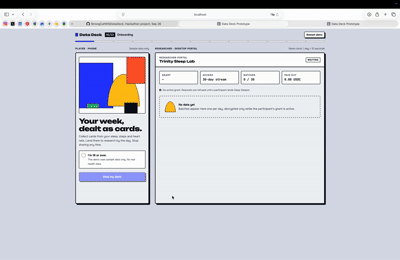

# Data Deck

**Collect cards, lend data by the day, keep the off switch.**

A consent-based marketplace for wearable health data. Your weekly data becomes collectible cards. Researchers post
bounties. Lending a card opens a **consent grant**: a time-limited, revocable access window, paid in USDC, recorded on
Solana. One tap stops sharing.

> **Devnet only. Sample data only. No real health data is used.**

## Demo



## Why

Your watch knows how you sleep, and research wants that data. Today you either give it away for good or not at all.
Data Deck lets people lend it for a set time, see exactly who gets what, get paid per day, and take access back at any
moment. The consent itself is public, tamper-proof state that neither we nor the researcher can edit.

For buyers, above all health AI companies, every grant doubles as a **provenance record**: where the data came from,
who consented, for what access and until when. Under the EU AI Act, high-risk AI providers must document how their
training data was collected (Art. 10(2)(b)); the deadlines were moved to 2 Dec 2027 (Annex III) and 2 Aug 2028 (AI in
regulated products) by the Digital Omnibus. Data Deck **helps buyers evidence** that; it does not make anyone "AI Act
compliant". Compliance stays with the AI provider.

## Demo flow (what works today)

1. **Deck**: cards are generated from the sample CSV, each with a plain-language "Why this card?".
2. **Bounty board**: three sample studies, each showing org type, access type, access window, retention, price and
   ethics reference.
3. **Consent sheet**: an *AI-generated summary* (Claude) sits above the full notice; nothing happens without an
   explicit **Confirm**.
4. **Grant opens**: the lent card stays in the deck. Its data is split into daily batches, each encrypted with its own
   AES-256-GCM key.
5. **Researcher portal** (`/researcher`): pulls a new batch every 10 s (one demo "day"), requests its key, decrypts it,
   and the player is paid `price_per_day` for each released batch.
6. **Auto-accept**: a player's standing rule ("non-profit university sleep studies, ≥ 0.50 USDC/day") accepts a
   matching study automatically and notifies them. Commercial buyers never auto-match.
7. **Stop sharing**: one tap revokes every active grant and disables auto-accept. The next key request gets
   `403 Access revoked by participant`, and every undelivered key is destroyed.

## Consent grants

| Type | Researcher gets | Ends | Player is paid |
|---|---|---|---|
| 24-hour snapshot | One encrypted package | 24 h after creation | Once |
| 30-day stream | One encrypted batch per day (10 s in the demo) | Day 30 or Stop sharing | Per released batch |
| Single query | One aggregate answer, never raw rows | After one key release | Once |

**Key release rule.** `/api/keys/[grantId]/[batch]` releases a key only while the grant is Active and unexpired.
Otherwise it answers 403 and shreds every unreleased key for that grant (crypto-shredding), so stored ciphertext
becomes unreadable.

**Stop sharing** stops all future key releases and payments, destroys undelivered keys, and logs an erasure request
to each researcher with the revoke transaction as proof of time. It cannot recall batches a researcher already
decrypted, and the app says so.

**Auto-accept guardrails** (fixed, not editable by the player): verified researchers with an ethics reference only;
commercial buyers never auto-match; at most a 30-day stream; a ruleset expires within 90 days; every auto-accept sends
a notification with a Stop sharing button. Only the ruleset's hash goes on-chain, so each auto grant proves which rule
created it.

## What's on-chain

Nothing health-related is ever written to the chain: no card names, values or study topics.

| On-chain (public) | Off-chain (app only) |
|---|---|
| Grant ID (random 16 bytes), player and researcher public keys | Card names, rarities, "Why this card?" |
| Salted bounty hash, rule hash | Bounty text, study topic, full notice |
| Access type, created / expires / revoked timestamps | Sleep, steps, heart-rate values |
| Price per day, status, `auto` flag | Ruleset contents, batch keys, ciphertext |
| USDC transfers (wallets and amount only) | |

The grant state can live in one of two places, behind the same interface (`GrantReader.readGrant(grantId)`):

- **Anchor program** `data_deck_grants` (`program/lib.rs`): Grant and RuleDelegate PDAs with `create_grant`,
  `revoke_grant`, `consume_grant`, `set_rule_delegate` and `disable_delegate`. Program ID
  `rwoLAon5MSWyDo1wTistRj2McNJTUF1f1pwdnxzJxLP`.
- **Memo fallback**: the same states as SPL Memo transactions signed by the player, for example
  `dd:grant id=7f3a… type=S30 exp=… price=… res=… bh=…`, `dd:revoke id=7f3a…`, `dd:rules …` and `dd:rules-off`.
  The server only counts memos signed by the right key, so nobody can forge a grant for someone else.

## How it maps to the rules

| Provision | What it asks | How Data Deck answers it |
|---|---|---|
| GDPR Art. 9(2)(a), 4(11) | Explicit, specific, informed consent for health data | Layered notice with explicit Confirm; auto-accept limited to narrow, expiring, non-commercial rules |
| GDPR Art. 7(3) | Withdrawing as easy as giving | One-tap Stop sharing, recorded on-chain |
| GDPR Art. 5(1)(e) | Storage limitation | Every bounty declares an access window **and** a retention period |
| EU AI Act Art. 10(2)(b) | Documented data origin and purpose for high-risk training data | Each grant records researcher, access type, duration and time of consent and revocation |
| EU AI Act Art. 50 | Disclose AI-generated content | Claude summaries are labelled "AI-generated summary", with the full notice below |

## Run it

```bash
npm install
cp .env.example .env.local
npm run dev          # player: http://localhost:3000   researcher: http://localhost:3000/researcher
npm test             # unit and route tests
```

The defaults need no wallet, no SOL and no API keys: grants are kept in memory (`GRANT_BACKEND=mock`) and payouts are
recorded without a chain call (`PAYOUT_MODE=simulate`).

To go on-chain (devnet):

```bash
npm run keys         # creates the researcher and rule-delegate keypairs in .env.local (never committed)
```

Then fund the printed addresses with a little devnet SOL (and the researcher with devnet USDC from
faucet.circle.com), and set in `.env.local`:

| Setting | Values |
|---|---|
| `GRANT_BACKEND` and `NEXT_PUBLIC_GRANT_BACKEND` (keep equal) | `mock` · `memo` · `anchor` (after the program is deployed) |
| `PAYOUT_MODE` | `simulate` · `devnet` (real devnet USDC from the researcher wallet) |
| `ANTHROPIC_API_KEY` | Enables live Claude summaries on the consent sheet |

## API

| Route | Does |
|---|---|
| `GET /api/cards`, `GET /api/bounties` | Deck from the sample CSV; sample bounties |
| `POST /api/explain` | Labelled AI summary of a bounty's full notice |
| `GET/POST /api/grants` | List a player's grants; open a grant (mock) or record a wallet-signed one (memo/anchor) |
| `GET /api/batches/[grantId]` | Ciphertexts released so far (one per demo day) |
| `GET /api/keys/[grantId]/[batch]` | Batch key if the grant is Active and unexpired, else 403 and shred; pays the batch |
| `POST /api/revoke` | Stop sharing: verify the revoke, shred keys, log erasure requests |
| `GET/POST/DELETE /api/rules` | A player's auto-accept ruleset (guardrails enforced) |
| `POST /api/auto-accept` | A new bounty: open delegate-signed grants for every matching player |
| `GET /api/payouts` | USDC paid so far, per player or grant |

## Code map

```
program/lib.rs              Anchor program data_deck_grants
src/lib/types.ts            Shared contract (grant, bounty, card, key types)
src/lib/csv.ts, cards.ts    Sample CSV → cards with "Why this card?"
src/lib/vault.ts, batches.ts  Per-batch AES-256-GCM and the in-memory key store
src/lib/grantAccess.ts      checkKeyAccess: the one rule the key API applies
src/lib/grants.ts           Grant backend factory (mock / memo / anchor)
src/lib/solana/             Anchor and Memo backends, tx builders, browser helpers
                            (lendCard, stopSharing, enableAutoAccept), USDC payout
src/lib/rules*.ts           Auto-accept guardrails, rulesets, matching
src/lib/explain.ts          Claude summary with a wording guard
scripts/make-keys.mjs       npm run keys
```

## Status

Verified on 26 Sep 2026: 94 tests pass, the type check is clean, `next build` succeeds, and the full mock flow above
was run end to end against the production server.

| Part | State |
|---|---|
| Deck, bounty board, consent sheet with AI summary | Working |
| Encrypted batches, key API, crypto-shredding, researcher portal | Working |
| Stop sharing (revoke, shred, erasure log) | Working |
| Auto-accept rules engine and notifications (API) | Working; ruleset builder screen is roadmap |
| Per-batch USDC payouts | Working in `simulate`; `devnet` mode needs a funded researcher wallet |
| Memo backend, wallet-signed grants and Stop sharing | Built and unit-tested; the dashboard buttons still call the mock path |
| Anchor program | Builds in Solana Playground; devnet deploy waits on test SOL (faucets were rate-limited) |

## Limits

- **Revocation is not retroactive.** Already-decrypted batches cannot be recalled; the erasure request is enforced by
  the researcher agreement, not by cryptography.
- **Pseudonymised, not anonymous.** Daily wearable series can re-identify people.
- **Wallet links are personal data**, even hashed (EDPB blockchain guidelines). Salted hashes and per-study researcher
  keys reduce linkage; per-grant wallets are roadmap.
- **Demo keys live in server memory.** Production needs a managed key store with per-player separation.
- **Production needs a DPIA** (Art. 35), joint-controller agreements with researchers (Art. 26) and legal review.

## Roadmap

Dataset provenance card with JSON export for AI buyers, ruleset builder screen, privacy panel ("what the chain sees"
vs "what the app sees"), per-grant wallets, EURC pricing, clinical-trial and health-AI buyers.
